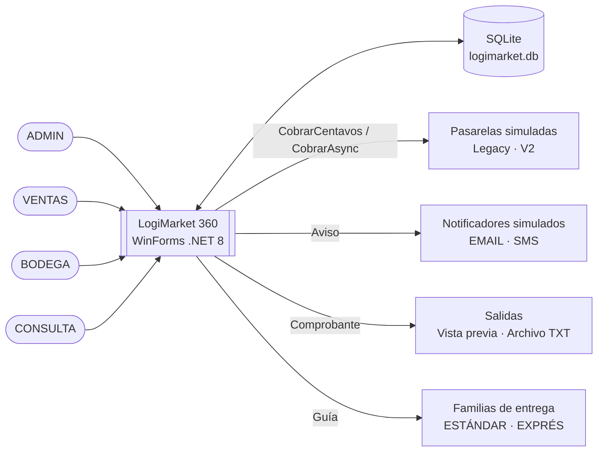

# Diagrama de contexto

```mermaid
flowchart LR
    ADMIN([ADMIN]) --> SYS
    VENTAS([VENTAS]) --> SYS
    BODEGA([BODEGA]) --> SYS
    CONSULTA([CONSULTA]) --> SYS
    SYS[[LogiMarket 360<br/>WinForms .NET 8]]
    SYS <--> DB[(SQLite<br/>logimarket.db)]
    SYS -->|CobrarCentavos / CobrarAsync| PAY[Pasarelas simuladas<br/>Legacy · V2]
    SYS -->|Aviso| NOTIF[Notificadores simulados<br/>EMAIL · SMS]
    SYS -->|Comprobante| OUT[Salidas<br/>Vista previa · Archivo TXT]
    SYS -->|Guía| LOG[Familias de entrega<br/>ESTÁNDAR · EXPRÉS]
```

Límites: no hay pasarelas, correos ni SMS reales; no se emiten facturas tributarias ni se calcula IVA.
