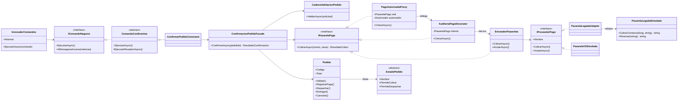

# Clases críticas — cadena de cobro, Facade y comandos

```mermaid
classDiagram
    direction LR
    class IPasarelaPago {
        <<interface>>
        +CobrarAsync(monto, clave) ResultadoCobro
    }
    class PagoAutorizadoProxy {
        -IPasarelaPago real
        -IAutorizador autorizador
        +CobrarAsync()
    }
    class AuditoriaPagoDecorator {
        -IPasarelaPago interior
        +CobrarAsync()
    }
    class EnrutadorPasarelas {
        +CobrarAsync()
        +AnularAsync()
    }
    class IProveedorPago {
        <<interface>>
        +Nombre
        +CobrarAsync()
        +AnularAsync()
    }
    class PasarelaLegadaAdapter
    class PasarelaV2Simulada
    class PasarelaLegadaSimulada {
        +CobrarCentavos(long, string) string
        +Reversar(string) string
    }
    IPasarelaPago <|.. PagoAutorizadoProxy
    IPasarelaPago <|.. AuditoriaPagoDecorator
    IPasarelaPago <|.. EnrutadorPasarelas
    PagoAutorizadoProxy --> AuditoriaPagoDecorator : delega
    AuditoriaPagoDecorator --> EnrutadorPasarelas : decora
    EnrutadorPasarelas --> IProveedorPago
    IProveedorPago <|.. PasarelaLegadaAdapter
    IProveedorPago <|.. PasarelaV2Simulada
    PasarelaLegadaAdapter --> PasarelaLegadaSimulada : adapta

    class ConfirmacionPedidoFacade {
        +ConfirmarAsync(pedidoId) ResultadoConfirmacion
    }
    class CadenaValidacionPedido {
        +ValidarAsync(solicitud)
    }
    class Pedido {
        +Codigo
        +Total
        +Validar()
        +RegistrarPago()
        +Despachar()
        +Entregar()
        +Cancelar()
    }
    class EstadoPedido {
        <<abstract>>
        +Nombre
        +PermiteCobrar
        +PermiteDespachar
    }
    ConfirmacionPedidoFacade --> CadenaValidacionPedido
    ConfirmacionPedidoFacade --> IPasarelaPago
    ConfirmacionPedidoFacade --> Pedido
    Pedido --> EstadoPedido : State

    class IComandoNegocio {
        <<interface>>
        +EjecutarAsync()
        +AlDenegarseAcceso(metricas)
    }
    class ComandoConEventos {
        <<abstract>>
        +EjecutarAsync()
        #EjecutarReceptorAsync()
    }
    class ConfirmarPedidoCommand
    class InvocadorComandos {
        +EjecutarAsync(comando)
        +Historial
    }
    IComandoNegocio <|.. ComandoConEventos
    ComandoConEventos <|-- ConfirmarPedidoCommand
    ConfirmarPedidoCommand --> ConfirmacionPedidoFacade
    InvocadorComandos --> IComandoNegocio
```
