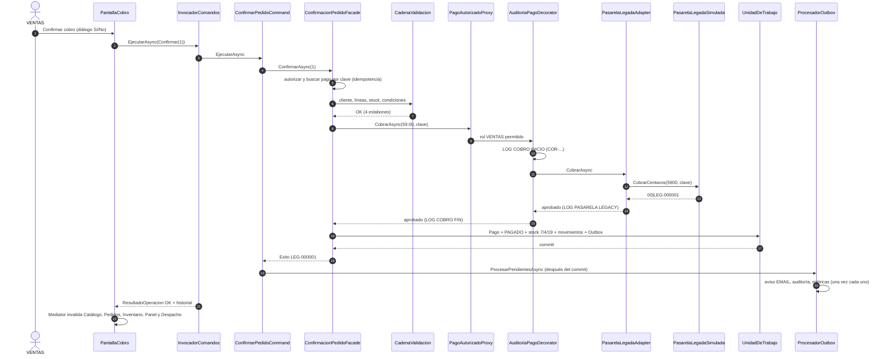

# Secuencia 1 — Confirmación con cobro aprobado (Ana, PED-001, USD 59.00)

```mermaid
sequenceDiagram
    autonumber
    actor V as VENTAS
    participant UI as PantallaCobro
    participant INV as InvocadorComandos
    participant CMD as ConfirmarPedidoCommand
    participant F as ConfirmacionPedidoFacade
    participant CH as CadenaValidacion
    participant PX as PagoAutorizadoProxy
    participant DEC as AuditoriaPagoDecorator
    participant AD as PasarelaLegadaAdapter
    participant LEG as PasarelaLegadaSimulada
    participant UOW as UnidadDeTrabajo
    participant OB as ProcesadorOutbox

    V->>UI: Confirmar cobro (diálogo Sí/No)
    UI->>INV: EjecutarAsync(Confirmar(1))
    INV->>CMD: EjecutarAsync
    CMD->>F: ConfirmarAsync(1)
    F->>F: autorizar y buscar pago por clave (idempotencia)
    F->>CH: cliente, líneas, stock, condiciones
    CH-->>F: OK (4 eslabones)
    F->>PX: CobrarAsync(59.00, clave)
    PX->>DEC: rol VENTAS permitido
    DEC->>DEC: LOG COBRO INICIO (COR-...)
    DEC->>AD: CobrarAsync
    AD->>LEG: CobrarCentavos(5900, clave)
    LEG-->>AD: 00|LEG-000001
    AD-->>DEC: aprobado (LOG PASARELA LEGACY)
    DEC-->>F: aprobado (LOG COBRO FIN)
    F->>UOW: Pago + PAGADO + stock 7/4/19 + movimientos + Outbox
    UOW-->>F: commit
    F-->>CMD: Exito LEG-000001
    CMD->>OB: ProcesarPendientesAsync (después del commit)
    OB->>OB: aviso EMAIL, auditoría, métricas (una vez cada uno)
    INV-->>UI: ResultadoOperacion OK + historial
    UI->>UI: Mediator invalida Catálogo, Pedidos, Inventario, Panel y Despacho
```
