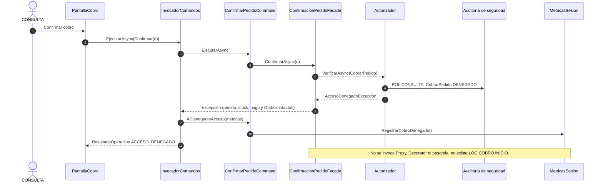
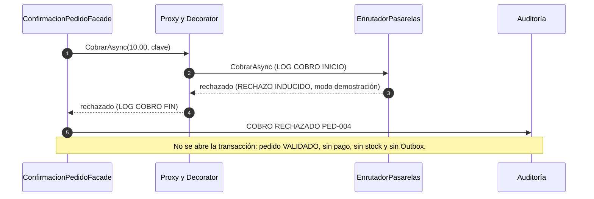

# Secuencia 2 — Operación rechazada: rol CONSULTA intenta cobrar (P22)

```mermaid
sequenceDiagram
    autonumber
    actor C as CONSULTA
    participant UI as PantallaCobro
    participant INV as InvocadorComandos
    participant CMD as ConfirmarPedidoCommand
    participant F as ConfirmacionPedidoFacade
    participant AUT as Autorizador
    participant SEG as Auditoría de seguridad
    participant MS as MetricasSesion

    C->>UI: Confirmar cobro
    UI->>INV: EjecutarAsync(Confirmar(n))
    INV->>CMD: EjecutarAsync
    CMD->>F: ConfirmarAsync(n)
    F->>AUT: VerificarAsync(CobrarPedido)
    AUT->>SEG: ROL CONSULTA: CobrarPedido DENEGADO
    AUT-->>F: AccesoDenegadoException
    F-->>INV: excepción (pedido, stock, pago y Outbox intactos)
    INV->>CMD: AlDenegarseAcceso(métricas)
    CMD->>MS: RegistrarCobroDenegado()
    INV-->>UI: ResultadoOperacion ACCESO_DENEGADO
    Note over F,MS: No se invoca Proxy, Decorator ni pasarela: no existe LOG COBRO INICIO.
```

# Secuencia 3 — Cobro rechazado por el proveedor (P06)

```mermaid
sequenceDiagram
    autonumber
    participant F as ConfirmacionPedidoFacade
    participant PX as Proxy y Decorator
    participant EN as EnrutadorPasarelas
    participant AUD as Auditoría

    F->>PX: CobrarAsync(10.00, clave)
    PX->>EN: CobrarAsync (LOG COBRO INICIO)
    EN-->>PX: rechazado (RECHAZO INDUCIDO, modo demostración)
    PX-->>F: rechazado (LOG COBRO FIN)
    F->>AUD: COBRO RECHAZADO PED-004
    Note over F,AUD: No se abre la transacción: pedido VALIDADO, sin pago, sin stock y sin Outbox.
```
